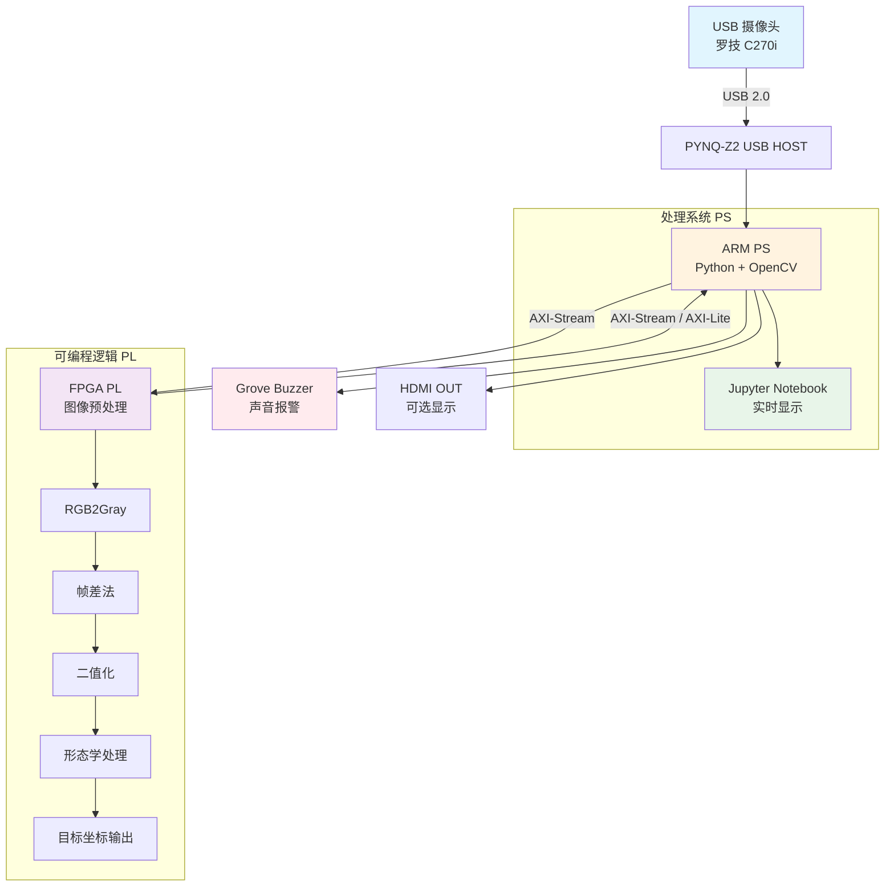
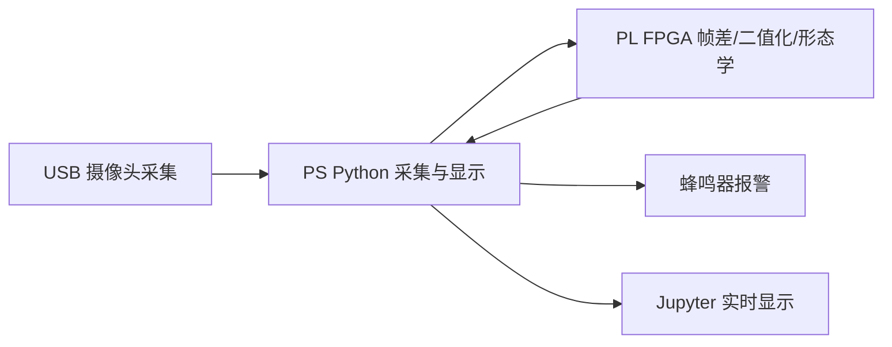

# 系统架构图

```mermaid
graph TD
    A[USB 摄像头<br/>罗技 C270i] -->|USB 2.0| B[PYNQ-Z2 USB HOST]
    B --> C[ARM PS<br/>Python + OpenCV]
    C -->|AXI-Stream| D[FPGA PL<br/>图像预处理]
    D -->|AXI-Stream / AXI-Lite| C
    C --> E[Grove Buzzer<br/>声音报警]
    C --> F[Jupyter Notebook<br/>实时显示]
    C --> G[HDMI OUT<br/>可选显示]

    subgraph PS[处理系统 PS]
        C
        F
    end

    subgraph PL[可编程逻辑 PL]
        D
        D1[RGB2Gray]
        D2[帧差法]
        D3[二值化]
        D4[形态学处理]
        D5[目标坐标输出]
        D --> D1 --> D2 --> D3 --> D4 --> D5
    end

    style A fill:#e1f5fe
    style C fill:#fff3e0
    style D fill:#f3e5f5
    style E fill:#ffebee
    style F fill:#e8f5e9
```

## 简化版架构

```mermaid
flowchart LR
    Input[USB 摄像头采集] --> PS[PS Python 采集与显示]
    PS --> PL[PL FPGA 帧差/二值化/形态学]
    PL --> PS
    PS --> Alarm[蜂鸣器报警]
    PS --> Display[Jupyter 实时显示]
```
